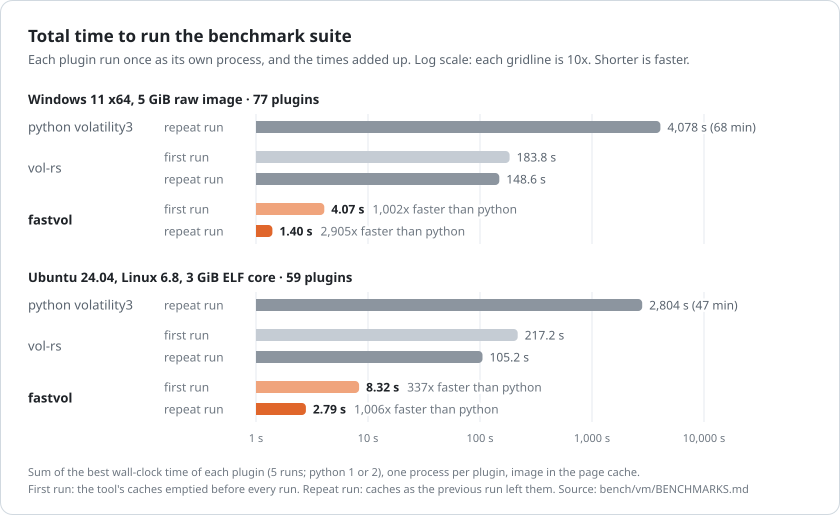
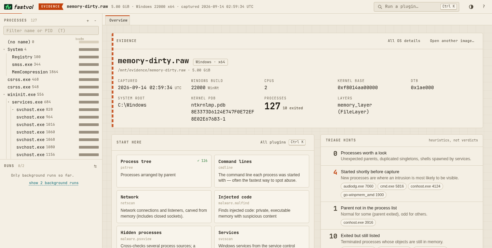

<p align="center">
  <picture>
    <source media="(prefers-color-scheme: dark)" srcset="docs/assets/logo-dark.svg">
    
  </picture>
</p>

<p align="center">
  <b>Volatility 3 memory forensics, rewritten in Rust.</b><br>
  Same plugins, same output, a fraction of the time.
</p>

<p align="center">
  <a href="https://github.com/volatilityfoundation/volatility3"></a>
  <a href="#highlights"></a>
  <a href="#verification"></a>
  <a href="#highlights"></a>
  <a href="#supported-images"></a>
  <a href="#license"></a>
</p>

<p align="center">
  <a href="#install">Install</a> ·
  <a href="#quick-start">Quick start</a> ·
  <a href="docs/usage.md">Usage</a> ·
  <a href="docs/web-ui.md">Web UI</a> ·
  <a href="#performance">Performance</a> ·
  <a href="#documentation">Docs</a>
</p>

<p align="center">
  <picture>
    <source media="(prefers-color-scheme: dark)" srcset="docs/assets/benchmark-dark.svg">
    
  </picture>
</p>

## Highlights

- **All 197 plugins** of volatility3 2.28.2, with the same options, `--help`, errors and exit codes.
- **Byte-identical output** to python volatility3 on 31 images, Windows XP to 11, Linux 3.2 to 7.0, macOS.
- **635-1,869x faster than python**, 6-68x faster than vol-rs.
- **Zero dependencies**: one static binary, Rust standard library only.
- **Every common format**: raw, LiME, ELF core, crash dump, VMware, QEMU, AVML, Xen, gzip/bzip2/xz.
- **Built-in web UI**: `vol serve`.

## Install

Requires Rust 1.95+. Tested on Linux x86-64.

```bash
cargo build --release    # -> target/release/vol
```

> [!NOTE]
> The binary is still named `vol` (development name: rsvol). The build targets the build machine's
> CPU; for a portable binary see [docs/building.md](docs/building.md#build-for-other-machines).

## Quick start

```bash
vol -f memory.raw windows.pslist.PsList                  # run a plugin
vol -h                                                   # list plugins
vol -s ./symbols -f linux.lime linux.pslist.PsList       # Linux/macOS: symbol dir
vol -f memory.raw -o out/ windows.dlllist.DllList --dump # dump files
vol -f memory.raw -r json windows.pslist.PsList          # quick, pretty, csv, json, jsonl
```

Windows symbols are downloaded automatically. See [docs/usage.md](docs/usage.md).

## Web UI

```bash
vol serve -f memory.raw    # prints a local URL with an access token
```

<p align="center">
  <picture>
    <source media="(prefers-color-scheme: dark)" srcset="docs/assets/screenshots/web-ui-overview-dark.png">
    
  </picture>
</p>

Plugin palette, million-row tables, process tree, hex viewer, run comparison, exports. Localhost
only, token-protected. [docs/web-ui.md](docs/web-ui.md)

## Supported images

| OS      | Arch     | Tested versions                                                             |
| ------- | -------- | --------------------------------------------------------------------------- |
| Windows | x64, x86 | XP, 2003, Vista, 2008, 7, 2012 R2, 10 (17763, 19041), 11 (22000, 26100)     |
| Linux   | x64, x86 | kernels 3.2, 4.15, 5.15, 6.1, 6.8, 6.17, 7.0                                |
| macOS   | x64      | 10.9, 10.12                                                                 |

Formats: raw, LiME, ELF core, Windows crash dump, VMware, QEMU savevm, AVML, Xen; gzip/bzip2/xz
compressed; `http(s)://` URLs; Windows page files.

## Verification

Every plugin's stdout, exit code and dumped files are diffed against python volatility3 2.28.2:

| Check                                     | Result                     |
| ----------------------------------------- | -------------------------- |
| No-argument runs, 31 images               | 1,975 / 1,975 identical    |
| Options x renderers sweep, 15 images      | ~4,000 cases, all match ³  |
| Fuzzing with corrupted images             | 17,000+ runs, 0 panics     |
| Unit tests                                | 535 passing                |

³ Except the documented gaps in [differences.md](docs/differences.md). How to run the gates: [docs/development.md](docs/development.md).

## Performance

Dedicated 32-vCPU KVM guest, image in page cache, sum of per-plugin best of 5
([full results](bench/vm/BENCHMARKS.md)). Cold = all caches empty; warm = repeat run.

|                              | python | vol-rs cold | vol-rs warm | fastvol cold | fastvol warm |
| ---------------------------- | -----: | ----------: | ----------: | -----------: | -----------: |
| Windows 11, 77 plugins       | 4078 s |     183.8 s |     148.6 s |       8.82 s |       2.18 s |
| Windows, median plugin       | 4.49 s |      624 ms |      164 ms |      68.6 ms |       8.6 ms |
| Linux 6.8, 59 plugins        | 2804 s |     217.2 s |     105.2 s |     35.4 s ¹ |       4.42 s |
| Linux, median plugin         | 18.3 s |      2.23 s |      311 ms |     541 ms ¹ |       9.8 ms |
| `windows.pslist` startup     | 1.87 s |      563 ms |     80.6 ms |      64.7 ms |       3.3 ms |
| Output identical to python   |    ref |     104/136 |     104/136 |    136/136 ² |    136/136 ² |

¹ 10.83 s total / 110 ms median with lazy symbol tables ([rerun](bench/vm/BENCHMARKS.md#first-runs-with-lazy-symbol-tables-rsvol-cold-rerun)).<br>
² 132 byte for byte; 4 compared sorted or against the reference machine, as python's own order varies ([details](docs/differences.md)).

Why it's fast: memory-mapped images and symbol tables, all-core scanning, lazy loading,
content-keyed caches that can't change output, and from-scratch libraries that beat the C
originals. [docs/architecture.md](docs/architecture.md#performance-techniques)

## Documentation

| Doc                                            | Content                                     |
| ---------------------------------------------- | ------------------------------------------- |
| [usage.md](docs/usage.md)                      | Symbols, dumping, renderers, filters, YARA  |
| [web-ui.md](docs/web-ui.md)                    | `vol serve` and its security model          |
| [building.md](docs/building.md)                | Build profiles, portable binaries           |
| [caching.md](docs/caching.md)                  | Cache files, `--clear-cache`, env variables |
| [differences.md](docs/differences.md)          | Known differences from python volatility3   |
| [architecture.md](docs/architecture.md)        | Internals and performance techniques        |
| [development.md](docs/development.md)          | Porting plugins, parity gates, benchmarks   |

## License

Volatility Software License 1.0, as a port of Volatility 3 ([LICENSE.txt](LICENSE.txt)). The web UI
embeds JetBrains Mono (SIL OFL 1.1).

fastvol is built on the work of the Volatility Foundation and the volatility3 contributors. It is
an independent project, not affiliated with or endorsed by the Volatility Foundation.
