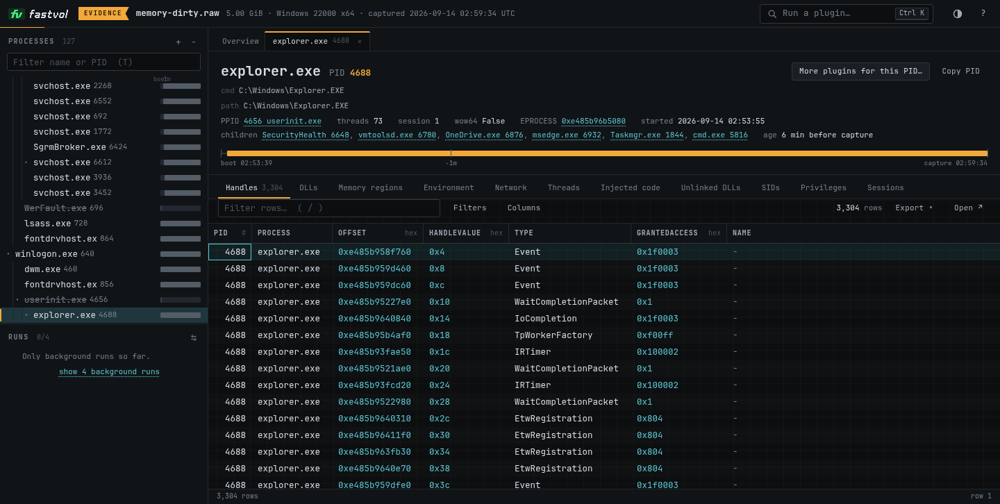
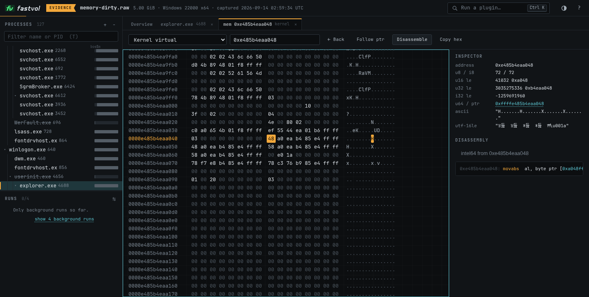

<p align="center">
  <picture>
    <source media="(prefers-color-scheme: dark)" srcset="docs/assets/logo-dark.svg">
    
  </picture>
</p>

<p align="center">
  <b>Volatility 3 memory forensics, rewritten in Rust.</b><br>
  Same plugins, same output, a fraction of the time.
</p>

<p align="center">
  <a href="https://github.com/volatilityfoundation/volatility3"></a>
  <a href="#highlights"></a>
  <a href="#verification"></a>
  <a href="#no-dependencies"></a>
  <a href="#supported-images"></a>
  <a href="#license"></a>
</p>

<p align="center">
  <a href="#install">Install</a> ·
  <a href="#quick-start">Quick start</a> ·
  <a href="docs/usage.md">Usage</a> ·
  <a href="docs/web-ui.md">Web UI</a> ·
  <a href="#performance">Performance</a> ·
  <a href="#verification">Verification</a> ·
  <a href="#documentation">Docs</a>
</p>

fastvol is a from-scratch Rust rewrite of [Volatility 3](https://github.com/volatilityfoundation/volatility3),
the memory forensics framework, at version 2.28.2. It has the same 197 plugins, the same options
and the same output: for a given image, plugin and set of arguments, stdout is byte-for-byte
identical to python volatility3, and dumping plugins write files with the same names and contents.
It ships as one static binary with no dependencies, and on a 5 GiB Windows image its median plugin
run takes about 10 ms, where python takes 4.5 s.

It is written for incident responders and forensic analysts who already use volatility3 and want
the same results without the wait.

<p align="center">
  <picture>
    <source media="(prefers-color-scheme: dark)" srcset="docs/assets/benchmark-dark.svg">
    
  </picture>
</p>

<p align="center"><sub>Measured on a dedicated 32-vCPU KVM guest. Method, per-plugin tables and output checks: <a href="bench/vm/BENCHMARKS.md">bench/vm/BENCHMARKS.md</a>.</sub></p>

## Highlights

- **Every plugin.** All 197 plugins of a full volatility3 2.28.2 install, including the YARA,
  capstone and pycryptodome based ones, with python's argument parser, `--help` text, error
  messages and exit codes.
- **Byte-identical output.** 1,975 of 1,975 plugin/image pairs match python on 31 memory images,
  from Windows XP to Windows 11 and from Linux 3.2 to 7.0. Where python fails, fastvol prints the
  same partial output and exits with the same status. [How it is checked](#verification).
- **Fast.** Over the benchmark suites, fastvol needs 635 to 1,869 times less time than python
  volatility3 on a repeat run, and 6 to 68 times less than vol-rs, another Rust port, like for
  like. [The numbers](#performance).
- **Zero dependencies.** One static binary built from the Rust standard library alone. The codecs,
  crypto, disassembler, regex and YARA engines, PDB parser and JSON parser are written from
  scratch and benchmarked against the libraries they replace. [Details](#no-dependencies).
- **Your images as they are.** Raw, LiME, ELF core, Windows crash dump, VMware, QEMU, AVML and Xen
  formats, images compressed with gzip, bzip2 or xz, and Windows swap files.
  [Supported images](#supported-images).
- **A web UI in the same binary.** `vol serve` opens an analysis workspace in the browser: a plugin
  palette, result tables that stay fast with millions of rows, a process tree, a hex viewer and
  disassembler, run comparison and exports. [Web UI](#web-ui).
- **Caches that cannot change output.** Symbol tables, kernel discovery results and scan hits are
  cached, keyed on their inputs and checked on load. With warm caches the median plugin run is
  under 10 ms on both benchmark images. [Caching](#caching).

## Install

> [!NOTE]
> fastvol was developed under the name **rsvol**, and the code still uses it: the binary is
> `vol`, the cache directory is `~/.cache/rsvol` and the environment variables start with
> `RSVOL_`. Every command in this README works as written. This README describes version 0.1.0,
> which tracks volatility3 2.28.2.

fastvol builds from source with Rust 1.95 or newer. Linux on x86-64 is the tested platform.

```bash
cargo build --release
```

This builds `target/release/vol`, a static binary with no runtime dependencies. Copy it anywhere
on your `PATH`; the examples below call it `vol`.

> [!IMPORTANT]
> The repository's build configuration compiles for the CPU of the build machine
> (`-C target-cpu=native`), so the binary can stop with an illegal instruction on an older or
> different CPU. To build a binary for other machines, see
> [docs/building.md](docs/building.md#build-for-other-machines).

[docs/building.md](docs/building.md) also covers the build profiles and the compiler flags.

## Quick start

Point `vol` at an image and name a plugin:

```bash
vol -f <IMAGE> windows.pslist.PsList
```

```text
Volatility 3 Framework 2.28.2

PID	PPID	ImageFileName	Offset(V)	Threads	Handles	SessionId	Wow64	CreateTime	ExitTime	File output

4	0	System	0xe485b4eaa040	134	-	N/A	False	2026-09-14 02:53:44.000000 UTC	N/A	Disabled
100	4	Registry	0xe485b4f1a080	4	-	N/A	False	2026-09-14 02:53:39.000000 UTC	N/A	Disabled
344	4	smss.exe	0xe485b555d040	2	-	N/A	False	2026-09-14 02:53:44.000000 UTC	N/A	Disabled
```

The command line is the one you know from volatility3. The most common options:

```bash
# list every plugin, then the options of one plugin
vol -h
vol windows.pslist.PsList -h

# Linux and macOS need symbol files that match the kernel: pass their directories with -s
vol -s <SYMBOL_DIR> -f <IMAGE> linux.pslist.PsList

# write dumped files to an existing directory with -o
vol -f <IMAGE> -o <OUTPUT_DIR> windows.dlllist.DllList --pid 828 --dump

# choose a renderer with -r: quick (default), pretty, csv, json, jsonl, mermaid, none
vol -f <IMAGE> -r json windows.pslist.PsList
```

Windows kernel symbols are downloaded from the Microsoft symbol server on first use, as python
does. [docs/usage.md](docs/usage.md) covers symbol setup on every OS, dumping, renderers, filters,
timelines and YARA scans.

## Web UI

`vol serve` starts a local web application for one image:

```bash
vol serve -f <IMAGE>
```

```text
rsvol web UI · Volatility 3 Framework 2.28.2
  image   /cases/memory-dirty.raw (5.0 GiB)
  output  /cases/vol-serve-output
  open    http://127.0.0.1:8765/#token=1c5fa1176bd21e349985b1160bfc6ac6
Anyone with this URL can read the image. Press Ctrl+C to stop.
```

<p align="center">
  <picture>
    <source media="(prefers-color-scheme: dark)" srcset="docs/assets/screenshots/web-ui-overview-dark.png">
    
  </picture>
</p>

Open the printed URL. The UI offers a searchable plugin palette with option forms, result tables
that stay fast with millions of rows, an interactive process tree with per-process views, a hex
viewer and disassembler over any layer, side-by-side comparison of two runs, and exports. The
image stays open between runs, so only the first plugin pays for kernel discovery.

The server listens on 127.0.0.1 by default and every API call must carry the random 128-bit
access token from the URL. Host headers are checked against DNS rebinding and cross-site requests
are refused. Treat the URL as a password. The full tutorial and reference, including the security
model, are in [docs/web-ui.md](docs/web-ui.md).

<details>
<summary>More screenshots</summary>
<br>
<p align="center">
  
</p>
<p align="center">
  
</p>
</details>

## Supported images

| Operating system | Architectures | Versions in the parity test set                                                                                                         |
| ---------------- | ------------- | --------------------------------------------------------------------------------------------------------------------------------------- |
| Windows          | x64, x86      | XP SP2 and SP3, Server 2003, Vista SP2, Server 2008 SP1, 7 SP1, Server 2012 R2, 10 (builds 17763 and 19041), 11 (builds 22000 and 26100) |
| Linux            | x64, x86      | kernels 3.2, 4.15, 5.15, 6.1, 6.8, 6.17 and 7.0                                                                                          |
| macOS            | x64           | 10.9.2 Mavericks, 10.12.6 Sierra                                                                                                        |

The format of an image is detected from its contents, as in volatility3:

- **Containers:** raw memory dumps, LiME, ELF cores (including QEMU and VirtualBox dumps), Windows
  crash dumps (full, bitmap and 32-bit), VMware `.vmem` files with their `.vmss` or `.vmsn` file
  next to them, QEMU savevm streams, AVML and Xen cores.
- **Compressed images:** gzip, bzip2 or xz, decompressed once, in parallel where the format
  allows, and cached.
- **Remote images:** `http://`, `https://` or `ftp://` URLs, downloaded once with `curl`.
- **Windows page files:** added with `--single-swap-locations`.

The [verification](#verification) table lists which formats each test image uses.

## Verification

Parity is tested by diffing fastvol's stdout, exit status and dumped files against python
volatility3 2.28.2, running on CPython 3.14.7 with capstone, yara-python and pycryptodome
installed. Every plugin that runs without arguments is compared on every image listed in
[bench/images.tsv](bench/images.tsv); at the last full gate **all 1,975 plugin/image pairs on 31
images were byte-identical** (0 diffs):

| OS          | Images (format)                                                                                                                                                                                         |
| ----------- | ------------------------------------------------------------------------------------------------------------------------------------------------------------------------------------------------------- |
| Windows x64 | Windows 11 22000 (raw, 5 GiB, 98 plugins); Windows 11 24H2 26100 (full crash dump); Windows 10 19041 (bitmap crash dump); Windows 10 17763 (raw); Server 2012 R2 9600 (raw); Windows 7 SP1 (raw, synthesized full crash dump) |
| Windows x86 | Windows 7 SP1 PAE (raw, synthesized bitmap crash dump); Server 2008 SP1 PAE (raw); Vista SP2 (32-bit crash dump); Server 2003 (raw); XP SP3 (32-bit crash dump); XP SP2 (raw)                           |
| Linux x64   | kernels 3.2 (Debian 7), 4.15 (Ubuntu 18.04: ELF core, VMware .vmem/.vmss, AVML), 5.15 (ELF, LiME), 6.8 (ELF, LiME), 6.17 (ELF, QEMU savevm), 7.0 (ELF)                                                  |
| Linux x86   | 4.15 PAE (ELF core, LiME), 6.1 i686 (raw, LiME)                                                                                                                                                         |
| macOS       | 10.9.2 Mavericks, 10.12.6 Sierra (raw)                                                                                                                                                                  |

Where python itself fails (for example `linux.kallsyms.Kallsyms` raising `TypeError`, x86-only
restrictions of the GUI plugins, or python bugs such as its 8-byte `Elf32_Sym` fields), fastvol
prints the same partial output and exits with the same status. On top of the no-argument gates:

- an option x renderer sweep ([bench/scripts/sweep.py](bench/scripts/sweep.py)): every plugin's
  options (`--pid`, `--dump`, offsets, filters, invalid values), all renderers, `--save-config`/`-c`
  round trips, on 15 of the images, ~4,000 cases;
- fuzzing with corrupted images ([bench/scripts/fuzz_images.py](bench/scripts/fuzz_images.py)):
  17,000+ plugin runs on 211 mutants, no panics; hangs/OOMs that python would also suffer are
  bounded;
- differential harnesses for the libraries: YARA engine vs yara-python, regex vs python `re`,
  disassembler vs capstone, PE parser vs pefile, PDB converter vs python's pdbconv, codecs and
  crypto vs the reference C libraries;
- unit tests (535) including python-generated fixtures for argparse, `--help` and the renderers.

See [docs/development.md](docs/development.md) for how to run the gates
(`bench/scripts/check_all.sh`, `check_win_images.sh`, `check_nix.sh`), and
[docs/architecture.md](docs/architecture.md#how-parity-is-guaranteed) for how the code is kept
faithful to python.

## Performance

These numbers come from [bench/vm/BENCHMARKS.md](bench/vm/BENCHMARKS.md), which holds the full
per-plugin tables and calls fastvol by its development name, rsvol (run 1 is kept in
[BENCHMARKS-run1.md](bench/vm/BENCHMARKS-run1.md)). They were measured on a dedicated KVM guest
with 32 vCPUs of an AMD EPYC 7302P host and 30 GiB of RAM, running Ubuntu 25.04, with nothing else
running. fastvol commit `95528b2` was compared with python volatility3 2.28.2 on CPython 3.14.7
and with vol-rs 1.0.0, another Rust port. Each figure is the wall-clock time of the whole process
with the image in the page cache, best of 5 interleaved runs. The method is in
[bench/vm/method.md](bench/vm/method.md).

fastvol has on-disk caches (see [Caching](#caching)), so it is reported three ways: **cold** (every
fastvol cache wiped before each run: a first-ever run), **steady** (symbol caches warm, per-image
scan cache disabled: the honest per-run cost of the scanning work) and **warm** (all caches warm:
what a second run of a plugin costs). vol-rs is reported cold (its caches wiped) and warm.

| Measurement (sum of per-plugin best)          | python | vol-rs cold | vol-rs warm | fastvol cold | fastvol steady | fastvol warm |
| --------------------------------------------- | -----: | ----------: | ----------: | -----------: | -------------: | -----------: |
| Windows 11 x64 build 22000, 5 GiB, 77 plugins | 4078 s |     183.8 s |     148.6 s |       8.82 s |         4.43 s |       2.18 s |
| Windows, median plugin                        | 4.49 s |      624 ms |      164 ms |      68.6 ms |        10.2 ms |       8.6 ms |
| Linux 6.8, 3 GiB ELF core, 59 plugins         | 2804 s |     217.2 s |     105.2 s |       35.4 s |         4.80 s |       4.42 s |
| Linux 6.8, median plugin                      | 18.3 s |      2.23 s |      311 ms |       541 ms |        10.1 ms |       9.8 ms |

Like for like (fastvol cold vs vol-rs cold, fastvol warm vs vol-rs warm): Windows 20.8x / 68.1x
faster in total, Linux 6.1x / 23.8x. Against python: Windows 463x / 1,869x, Linux 79.3x / 635x.
fastvol steady and warm are the fastest of the three tools on every plugin except `vmscan.Vmscan`,
where vol-rs ships no VMCS symbol files and returns an empty table without reading the image,
while python and fastvol scan all 5 GiB. (Since that run, the scan cache also keeps the image bytes
vmscan's checks read, see [docs/architecture.md](docs/architecture.md#the-scan-cache).)

In that run a first-ever Linux run spent about 0.53 s indexing and converting the kernel's 64 MB
symbol file before the plugin started. Since then, first runs load big symbol files lazily and
write their binary tables after the output: in a rerun on the same VM the Linux cold total fell
from 34.19 s to 10.83 s (median plugin 517 ms to 110 ms), and fastvol cold beat vol-rs warm on all
59 plugins. See
[First runs with lazy symbol tables](bench/vm/BENCHMARKS.md#first-runs-with-lazy-symbol-tables-rsvol-cold-rerun).

`windows.pslist.PsList` startup: fastvol 64.7 ms cold / 3.3 ms warm, vol-rs 563 ms / 80.6 ms,
python 1.87 s / 1.20 s.

On that run fastvol's stdout matched python's on every plugin: byte for byte on 74 of the 77
Windows and 58 of the 59 Linux plugins, and for the rest after sorting (two plugins whose python
output order changes between runs) or against python on the reference machine
(`timeliner.Timeliner`, whose python output depends on the directory order of python's
installation). vol-rs matched on 59/77 Windows and 45/59 Linux plugins.

## Comparison

Everything in this table comes from the benchmark run above.

|                                                   | python volatility3        | vol-rs              | fastvol                          |
| ------------------------------------------------- | ------------------------- | ------------------- | -------------------------------- |
| Version measured                                  | 2.28.2, on CPython 3.14.7 | 1.0.0               | 0.1.0 (`95528b2`)                |
| Reports volatility3 framework version             | 2.28.2                    | 2.28.0              | 2.28.2                           |
| Written in                                        | Python                    | Rust                | Rust, standard library only      |
| stdout equal to python, Windows / Linux plugins   | reference                 | 59 of 77 / 45 of 59 | 77 of 77 / 59 of 59 <sup>1</sup> |
| Windows, 77 plugins: total, cold / warm           | 4,078 s <sup>2</sup>      | 183.8 s / 148.6 s   | 8.82 s / 2.18 s                  |
| Linux, 59 plugins: total, cold / warm             | 2,804 s <sup>2</sup>      | 217.2 s / 105.2 s   | 35.4 s / 4.42 s <sup>3</sup>     |
| Median plugin, warm, Windows / Linux              | 4.49 s / 18.3 s           | 164 ms / 311 ms     | 8.6 ms / 9.8 ms                  |
| `windows.pslist.PsList`, cold / warm              | 1.87 s / 1.20 s           | 563 ms / 80.6 ms    | 64.7 ms / 3.3 ms                 |

<sup>1</sup> Byte for byte on 74 of 77 and 58 of 59; the rest as described [above](#performance).
<sup>2</sup> One python column: runs with python's identifier cache warm.
<sup>3</sup> 10.83 s with lazy symbol tables, in a later rerun of the cold column.

## Why it is fast

The design rule is to know the hardware and do the minimum work.

- **Map, don't read.** The image and the cached symbol tables are memory-mapped and used in place,
  never copied into memory.
- **Do only what the plugin asks.** Nothing happens before a plugin needs it. A first run
  resolves only the types and symbols it uses; a warm run loads a binary symbol table with one
  `mmap` and replays cached scan hits instead of rereading memory.
- **Use the whole machine.** Scans, per-process work, symbol table builds and row formatting run
  on all cores, and AVX2, AES-NI and SHA-NI code paths are selected at run time.
- **Keep the fixed cost small.** A static binary with no dynamic loader and a lazy start: a warm
  `windows.pslist.PsList` takes 3.3 ms.
- **Fix the algorithm, not just the language.** Some of python's time goes into algorithms that
  fastvol replaces with cheaper ones that give the same output. The page walk of python's
  `windows.statistics.Statistics` is quadratic, re-walking every valid run per step, and took
  1,687 s on the benchmark image; fastvol walks each page once and took 25.5 ms warm.
- **Beat the libraries it replaces.** Each from-scratch library is benchmarked against the
  original on the same input, for example AES at about twice OpenSSL's speed and the regex and
  YARA engines at 1.3 to 20 times the best of PCRE2-JIT and RE2
  ([bench/PACKAGES.md](bench/PACKAGES.md)).

The full list of techniques is in
[docs/architecture.md](docs/architecture.md#performance-techniques).

## No dependencies

`Cargo.toml` has an empty `[dependencies]` table and must stay that way. fastvol uses the Rust
standard library and calls a few libc functions such as `mmap` directly, since `std` already links
libc. Everything python volatility3 gets from third-party packages is implemented in the tree:
xz/lzma, zlib, bzip2, snappy, LZNT1 and Xpress codecs, MD5, SHA-1, SHA-256, RC4, DES and AES,
a capstone-compatible x86 disassembler, a regex engine with python `re` semantics, a YARA rule
engine, a PDB to ISF converter, and readers for JSON, zip and SQLite files.

The only external program fastvol runs is `curl`, and only where python volatility3 goes to the
network: downloading PDB files from the Microsoft symbol server, images given to `-f` or
`--single-location` as `http://`, `https://` or `ftp://` URLs together with the `.vmss` or `.vmsn`
file next to a remote `.vmem`, and remote ISF lists and files named with `-u/--remote-isf-url`.
`--offline` disables all of them.

## Caching

fastvol keeps its own cache in `~/.cache/rsvol`, or in `$XDG_CACHE_HOME/rsvol` when that variable
is set: binary symbol tables, a symbol file index, kernel discovery results, raw scan hits,
downloads and decompressed images. It also reads and writes python's symbol directory
`~/.cache/volatility3/symbols`, so symbol files downloaded by either tool are shared.

A cache can make a run faster but cannot change its output. Every cache file stores its complete
key and compares it on load, keys identify their inputs (for images: canonical path, size and
modification time), the scan cache stores raw matches that every plugin validates again as python
would, and the parity gates run once with an empty cache and once warm. The one assumption is that
an image whose size and modification time did not change still has the same contents.

```bash
vol --clear-cache -f <IMAGE> windows.info.Info    # empty the caches, then run
RSVOL_CACHE=<EMPTY_DIR> vol -f <IMAGE> windows.info.Info    # a cold run that leaves your cache alone
```

Every cache file, how symbol files are chosen, what `--clear-cache` deletes and all environment
variables (`RSVOL_CACHE`, `RSVOL_THREADS`, `RSVOL_NO_SCAN_CACHE`, `RSVOL_TRACE` and others) are
documented in [docs/caching.md](docs/caching.md).

## Known differences from python volatility3

The few places where fastvol's output can differ from a python run are listed in
[docs/differences.md](docs/differences.md). In short:

- plugins whose python output order changes from run to run (python `set` iteration, randomized
  string hashing) are compared sorted or with `PYTHONHASHSEED=0`;
- `-c` configuration files are followed for options and images, but kernel discovery runs again;
- `timeliner.Timeliner` and `frameworkinfo.FrameworkInfo` use the plugin order of the reference
  installation, where python uses its file system's directory order;
- usage lines say `vol`, there is no progress output, `-p/--plugin-dirs` cannot load python
  plugins and `--parallelism` has no effect;
- YARA rules that `import` a module and `--yara-compiled-file` are not supported;
- a corrupt compressed image stops the run before the plugin starts, and a corrupt circular list
  that would make python loop forever ends with an error;
- `isfinfo.IsfInfo` and `timeliner.Timeliner --record-config` differ in small, documented
  details, and the reference is CPython 3.14, under which python prints some values differently
  than under 3.13.

## Documentation

| Document                                               | Type                   | Content                                              |
| ------------------------------------------------------ | ---------------------- | ---------------------------------------------------- |
| [docs/usage.md](docs/usage.md)                         | How-to                 | Symbols per OS, dumping, renderers, filters          |
| [docs/web-ui.md](docs/web-ui.md)                       | Tutorial and reference | `vol serve`, its options and security model          |
| [docs/building.md](docs/building.md)                   | How-to                 | Build profiles, compiler flags, portable binaries    |
| [docs/caching.md](docs/caching.md)                     | Reference              | Cache files, `--clear-cache`, environment variables  |
| [docs/differences.md](docs/differences.md)             | Reference              | Every known difference from python volatility3       |
| [docs/architecture.md](docs/architecture.md)           | Explanation            | How fastvol is built and why it is fast              |
| [docs/development.md](docs/development.md)             | How-to                 | Porting plugins, parity gates, benchmarks            |
| [bench/vm/BENCHMARKS.md](bench/vm/BENCHMARKS.md)       | Reference              | Full benchmark results, per plugin                   |
| [DESIGN.md](DESIGN.md)                                 | Rules                  | The contributor contract                             |
| [src/objects/README-API.md](src/objects/README-API.md) | Reference              | python to Rust API cheat-sheet                       |

## Contributing

Read [DESIGN.md](DESIGN.md) first: zero crates, byte-identical output, no panics on malformed
memory. [docs/development.md](docs/development.md) explains how to port a plugin and how to prove
it matches python.

## License

fastvol is a port of Volatility 3 and is distributed under the Volatility Software License 1.0,
the license of volatility3. The full text is in [LICENSE.txt](LICENSE.txt). Every source file
ported from volatility3 carries a header saying so. The license requires that you publish the
source of changes and additions you make available to others, and it counts ports and
translations as additions.

The web UI embeds a subset of the JetBrains Mono font, which is licensed under the SIL Open Font
License 1.1; see [src/web/assets/OFL.txt](src/web/assets/OFL.txt).

## Acknowledgements

fastvol exists because of [Volatility 3](https://github.com/volatilityfoundation/volatility3). Its
plugins, algorithms and output formats are the work of the Volatility Foundation and the
volatility3 contributors, and python volatility3 is the reference that every fastvol result is
checked against. The differential tests also rely on yara-python, capstone, pefile and the C
libraries whose behaviour the from-scratch implementations reproduce.

fastvol is an independent project. It is not affiliated with or endorsed by the Volatility
Foundation.
